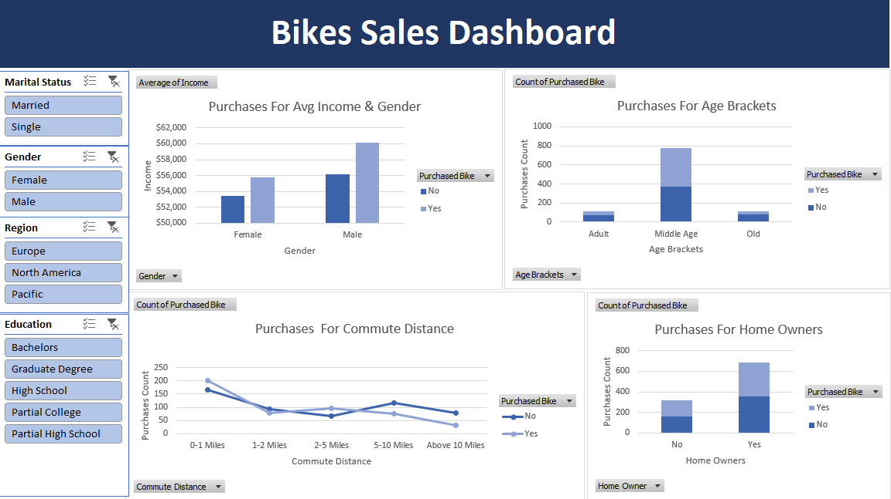

# 1_ Bike Sales Project

## Implemntaion Steps For The Project
### 1_Cleaning the data.
### 2_EDA.
### 3_Preparing pivot tables.
### 4_Creating charts.
### 5_Creating a dashboard.

# 2_ Revenue Investigating  Project

## Implemntaion Steps For The Project
### 1_Cleaning the data.
### 2_EDA.
### 3_Preparing pivot tables.
### 4_Creating charts.
### 5_Creating a dashboard.

